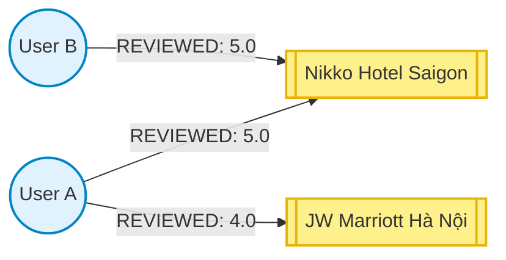
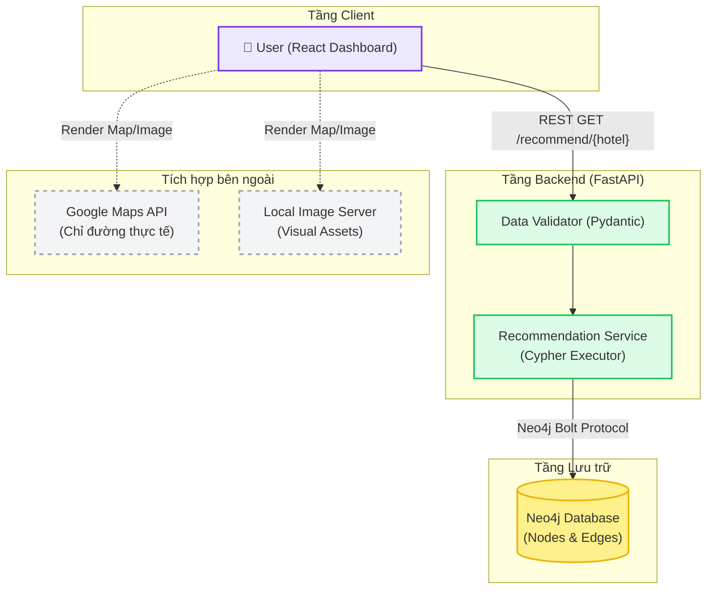

# Project Proposal

## THÔNG TIN

### Nhóm

| **Thành viên 1** | Trương Thế Hải Thịnh – 23725051 |
| :--- | :--- |
| **Thành viên 2** | Nguyễn Thị Quỳnh Trang – 23676071 |
| **Thành viên 3** | Ngô Phước Thiên – 23670311 |
| **Thành viên 4** | Vũ Ngọc Thu Phương – 23696981 |
| **Git Repository** | https://github.com/TruongTheHaiThinh/hotel-recommender-neo4j |

### Cấu trúc nhánh Git

| Nhánh | Mục đích | Người phụ trách |
| :--- | :--- | :--- |
| `feature/data-processing` | Xử lý dữ liệu Kaggle, lọc rác, chuẩn hóa Alias | Phương, Trang |
| `feature/neo4j-integration` | Khởi tạo Graph DB, xây dựng thuật toán CYPHER | Thịnh |
| `feature/backend-api` | Xây dựng RESTful API bằng FastAPI | Thịnh |
| `feature/frontend-ui` | Giao diện React Dashboard, tích hợp UX/UI | Thiên, Phương |
| `main` | **Push cuối cùng – bản hoàn chỉnh để nộp/deploy** | Cả nhóm |

> **Quy trình làm việc:**
> 1. Mỗi nhóm nhỏ làm việc trên nhánh `feature/*` riêng.
> 2. Đẩy code lên nhánh của mình sau mỗi phiên.
> 3. Review logic (đặc biệt là thuật toán đồ thị) trước khi gộp vào `main`.

---

# MÔ TẢ DỰ ÁN: HOTEL RECOMMENDATION SYSTEM SỬ DỤNG GRAPH MINING

## 1. Ý TƯỞNG DỰ ÁN (THE VISION)

**Tổng quan nền tảng**  
Trong hệ sinh thái du lịch hiện đại, việc người dùng phải lướt qua hàng ngàn đánh giá để tìm khách sạn là rất tốn thời gian. Nhóm chúng tôi quyết định xây dựng một **Hệ thống gợi ý khách sạn thông minh** dựa trên kỹ thuật **Graph Mining** (Khai phá dữ liệu đồ thị). Thay vì chỉ dùng điểm số đơn thuần, hệ thống phân tích "hành vi bầy đàn" – những người dùng có cùng gu thẩm mỹ và sở thích lưu trú để đưa ra các đề xuất chéo cực kỳ chính xác.

**3 Trụ cột kỹ thuật của Hệ thống:**
- **Graph Database Engine:** Sử dụng Neo4j để lưu trữ cấu trúc Topology mạng lưới phức tạp giữa User và Hotel.
- **Real-time Recommendation API:** Backend FastAPI xử lý các truy vấn CYPHER phức tạp chỉ trong vài mili-giây.
- **Premium Visualization:** Dashboard giao diện React/TailwindCSS mang lại trải nghiệm chuẩn 5 sao với dữ liệu thực tế từ Google Maps.

---

## 2. MÔ HÌNH THỰC THỂ ĐỒ THỊ (GRAPH SCHEMA)

Hệ thống được thiết kế tối giản nhưng mạnh mẽ với 2 Node cốt lõi và 1 Relationship:

| Thực thể / Quan hệ | Loại | Thuộc tính chính | Mô tả |
| :--- | :--- | :--- | :--- |
| **User** | Node | `id` (Unique) | Đại diện cho khách hàng Tripadvisor. |
| **Hotel** | Node | `name` (Unique) | Tên khách sạn 5 sao chuẩn hóa. |
| **REVIEWED** | Edge | `rating` (Float), `review` (Text) | Trọng số và cảm nhận của User về Hotel. |

---

## 3. CHI TIẾT NGHIỆP VỤ & THUẬT TOÁN ĐỀ XUẤT

### 3.1 Tiền xử lý dữ liệu (Data Pre-processing)
Dữ liệu thô từ Kaggle chứa rất nhiều nhiễu. Hệ thống tự động thực hiện:
- **Blacklist Filtering**: Loại bỏ các địa danh không phải nơi lưu trú (Nhà hát, Dinh Độc Lập...).
- **Alias Merging**: Gộp tự động các từ khóa sai chính tả (VD: *Majetic Hotel*, *Crown Plaza*) về một Node chuẩn duy nhất để hội tụ dữ liệu.
- **Metadata Tagging**: Gắn thêm siêu dữ liệu (Thành phố, URL Ảnh gốc, Tọa độ Maps) cho từng Node khách sạn ngay trên tầng Backend.

### 3.2 Thuật toán Collaborative Filtering qua Đồ thị
Khi người dùng đang xem khách sạn **A**:
1. Hệ thống tìm tất cả các **User** đã từng review khách sạn **A**.
2. Từ tập User đó, quét tiếp xem họ đã review những khách sạn **B**, **C** nào khác.
3. Nhóm các khách sạn B, C lại, tính tổng số lần xuất hiện (Degree) và trung bình cộng điểm Rating.
4. Trả về top 5 khách sạn có mức độ liên kết cao nhất.

---

## 4. KIẾN TRÚC HỆ THỐNG

---

## 5. PHÂN TÍCH & THIẾT KẾ (MoSCoW Framework)

### Nhóm MUST-HAVE (Bắt buộc – MVP):
- Tự động đọc, làm sạch và import 20,000+ records từ CSV vào Neo4j.
- Xây dựng mạng lưới Node `User`, `Hotel` và quan hệ `REVIEWED`.
- Viết câu truy vấn CYPHER tìm "Khách sạn tương đồng qua hành vi chung".
- API trả về dữ liệu nhanh chóng kèm Metadata ảnh và vị trí.
- Giao diện Dashboard hiển thị thẻ khách sạn và điểm số.

### Nhóm SHOULD-HAVE:
- Click vào khách sạn để mở Review Modal (xem chi tiết nhận xét).
- Nút "Chỉ đường" liên kết trực tiếp tới Google Maps.
- Chuẩn hóa tên Alias (Gộp node trùng lặp).

### Nhóm COULD-HAVE:
- Lọc khách sạn theo khu vực (Ví dụ: Chỉ gợi ý các khách sạn ở Hà Nội hoặc TP.HCM).

---

## 6. KẾ HOẠCH & PHÂN CÔNG PHÁT TRIỂN

| **Module Kỹ thuật** | **Người thực hiện chính** |
| :--- | :--- |
| **Data Pipeline**: Python Pandas xử lý CSV, tạo thuật toán Regex trích xuất tên, lọc rác. | Phương, Trang |
| **Neo4j Engine**: Thiết kế Schema, chạy Constraint, viết câu lệnh CYPHER đề xuất. | Thịnh |
| **Backend API**: Thiết lập FastAPI, uvicorn, cấu hình .env bảo mật, map dữ liệu. | Thịnh |
| **Frontend UI/UX**: Xây dựng React Vite, thiết kế Layout thẻ Card, Modal trải nghiệm. | Thiên |

---

## 7. NHẬN XÉT & ĐÁNH GIÁ TỪ NHÓM (EVALUATIONS)

Sau quá trình triển khai dự án Recommendation System bằng phương pháp Graph Mining, nhóm rút ra các đánh giá kỹ thuật chuyên sâu sau:

1. **Sức mạnh của Graph Database (Neo4j) so với Relational DB (SQL):**
   * Thuật toán tìm kiếm "Bạn của bạn" (Collaborative Filtering) trong Neo4j chạy mượt mà thông qua kỹ thuật duyệt Node. Nếu dùng SQL truyền thống, chúng ta sẽ phải thực hiện ít nhất 3 vòng `JOIN` khổng lồ giữa bảng `Users` và `Reviews`, dẫn đến hiệu năng giảm sút nghiêm trọng khi dữ liệu phình to. 
   * Tuy nhiên, việc import dữ liệu ban đầu vào Neo4j đòi hỏi thiết kế Batch (nhóm 1000 records) bằng lệnh `UNWIND` để không bị nghẽn RAM.

2. **Khó khăn trong việc chuẩn hóa dữ liệu Text (NLP/Mining):**
   * Dữ liệu review trên Tripadvisor là free-text. Việc trích xuất đúng tên khách sạn là một thử thách lớn. Dù đã dùng Regex và tập Keyword, hệ thống vẫn cần một bộ quy tắc cứng (Blacklist/Alias) để xử lý các tên đặc thù như "Nikko Hotel" và "Nikko Hotel Saigon". Khâu Data Cleaning chiếm tới 40% công sức toàn dự án.

3. **Giao diện và Trải nghiệm người dùng (UX):**
   * Thuật toán tốt cần một giao diện xứng tầm. Việc nhóm tự ánh xạ thêm bộ ảnh Local chất lượng cao và tích hợp link Google Maps ở tầng Backend giúp ứng dụng thoát khỏi mác "Đồ án khô khan", mang lại cảm giác của một sản phẩm thương mại thực thụ (Premium Dashboard).

4. **Khả năng mở rộng tương lai:**
   * Hiện tại, mô hình mới chỉ dừng ở mức tính *Số lượng kết nối chung*. Trong tương lai, mô hình hoàn toàn có thể nâng cấp bằng thuật toán **PageRank** (Đánh giá mức độ uy tín của khách sạn) hoặc áp dụng thêm **GNN (Graph Neural Networks)** để dự đoán chính xác hơn sở thích ngầm của người dùng.
